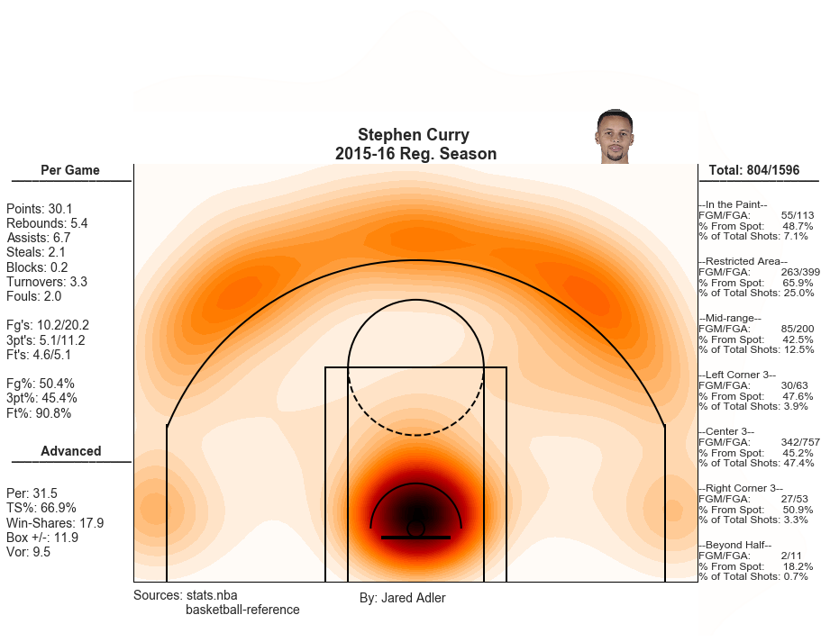
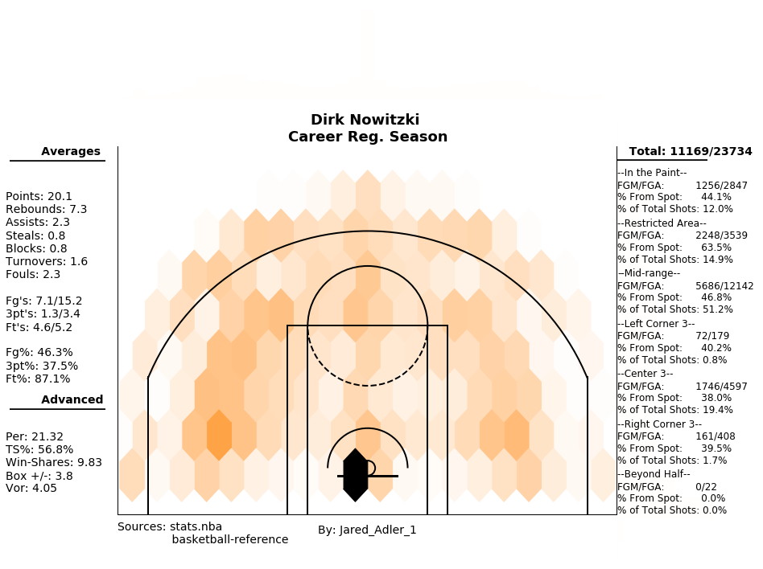

# NBA
NBA Player Shots (Season/Career)

# NBA Players Career and Season Shots

> This repository contains visualizations for NBA players using Python3 Notebooks.

> In the notebooks titled "NBA_Player_Career_Stats.ipynb" and "NBA_Player_Stats_Single_Season.ipynb" you will find visualizations containing players shots and their statistics for either a given year or for their careers.

